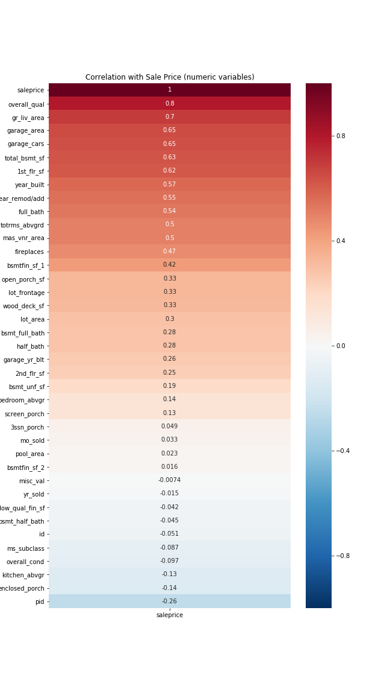

# Executive Summary

**Ames Housing Data and Kaggle Challenge** 
*Author: Brendan Lo*
---

## Problem Statement
Understanding a fair price for a house is crucial for consumers before they decide to buy a house. There is no easy way to determine a fair price for a house without doing extensive research about various factors of that property. Using housing data of over 2,000 entries of houses from Ames Iowa, I aim to develop a Multi-Linear Regression model that can best predict sale price of a house based on other variables. 

Success will be evaluated based on metrics such as **Root Mean Squared Error** and **R2** which are key metrics in describing model predictions vs. actual values and how well the model explains variability.

The goal of this model is to provide consumers with a tool to get a good price estimate of a house before looking further into the details of buying a house in Ames, Iowa. In the process, I also hope to gain insights on what are important variables to consider that ultimately can affect a house's sale price.

___

## Contents:
- [Data Dictionary](#Data-Dictionary)
- [Data Cleaning](#Data-Cleaning)
- [Exploratory Data Analysis](#Exploratory-Data-Analysis)
- [Preprocessing and Modeling](#Preprocessing-and-Modeling)
- [Conclusions and Recommendations](#Conclusions-and-Recommendations)
- [Next Steps](#Next-Steps)
  
    
 
 

___

## Data Dictionary
The data used for analysis and modeling for this project is housing data of Ames, Iowa provided by Ames, Iowa Assessor's office. The Data set contains information from the Ames Assessor’s Office used in computing assessed values for individual residential properties sold in Ames, IA from 2006 to 2010.

All variable descriptions were derived from the provided data dictionary [here](http://jse.amstat.org/v19n3/decock/DataDocumentation.txt).

 

___

## Data Cleaning
Understanding basic information about our data:
- A Dataframe shape of (2051, 81) indicates that our dataset has 2051 rows and 81 columns.
- Our data is organized as either numerical variables or categorical variables.
- A count of 9822 null values were found in the dataset.

Naming Convention to lowercase:
- All column names where converted to lowercase letters and spaces where replaced with underscores. Having the same naming convention for all variables makes it easier to navigate our data.
___ 

**Imputing Null values**  
There are clearly a large amount of null values in this data set. These must be imputed accordingly before any further analysis or modeling can be made.  
To single out how to attack this problem, I closed in on what columns had null values to be imputed.

**Categorical vs. Numerical Variables**  
From the list columns containing null values, we can see that there are both *categorical variables* and *numerical variables*. By cross-referencing the [data dictionary](http://jse.amstat.org/v19n3/decock/DataDocumentation.txt), I decided that the null values for the **categorical variables** could not be dropped. The nulls in those categories usually meant 'none'.  

*For example, a null value in the 'fireplace' column simply meant that the house had 'no fireplace' and is still valuable data to be kept in our data set* 
 
  
For our **numerical variables**, we also can't drop all the data for the following reasons:
- Dropping all null values would result in us losing a very large amount of the dataset. Reminder that we only have around 2051 rows of data.
- Unlike the categorical variables, for numerical data we can't be sure if it refers to 'none'/0 or if the value is simply missing information.  

*For example, we can't know for sure if a null value in the 'basement_sf' column simply meant that the house had 'no basement' and is 0 square ft., or if we are just missing data on the house's basement_sf (in the case the house actually has a basement).*

 
 

**My Solution to Cleaning Null values**  
- All categorical null values were imputed with the string 'none'.
- To combat the uncertainty conscerning numerical null vales, I impute null values with the average value for the neighborhood of that specific house.   
  *** *note that this is under the assmuption that each neighborhood has similarity in their variable values.***
- If a relating column shows 'none' instead, I know that it is safe to impute value with 0.

Example:  
*Assuming a house we are examining is in Bloomington Heights. If the basement_sf column shows a null value, we will impute the null value with the average basement_sf of houses in Bloomington Heights, unless another relating column such as basment quality has data that show that there is no basement. In the case of no basement, we instead impute with 0.*

___

## Exploratory Data Analysis (EDA)
Exploring basic trends of our y-variable: Sale Price.

  
  
**What Do we See?**  
We can see that price is slightly left skewed with most housing prices ranging between 100,000 dollars and 300,000 dollars. More precisley, from the boxplot we can see the inter-quartile range aka middle 50% to be between approximately 150,000 dollars and 250,000 dollars. Although most housing prices are in a certain price range, we can also see that there is a wide spread of housing prices at higher price levels. You can see this with the histrogram's long tail beyond 300,000 dollars and the spread of outlier points on the boxplot.

___

**Determining Variable Relationships**  
Using a heatmap, finding variables with high correlation (both positive or negative) to sale price is a good starting point to know which variables should be included in our model.

Based on the heatmap we can now look at only the variables that had a strong correlation with sale price. We can take closer looks at those relationships with scatter plots. Below I'm diving deeper to a few numerical variables that have a correlation (both positive or negative) greater than or equal to 0.5.

 

 

**Dropping Outliers**  
The two points in the below graph that were greater than 5000 square feet were dropped from the data set. These look to be incomplete or partial sales of homes which explains why those houses with such high square footage were sold for comparatively low values. The [data dictionary](http://jse.amstat.org/v19n3/decock/DataDocumentation.txt) also identifies these specific data points as outliers in the SPECIAL NOTES section.

 

 

The data point in the below graph over 3500 square feet was also dropped with the same reasons as the previous drops. This outlier was likely a partial sale that doesn't accurately represent our overall data.

 

 

**What Do we See?**  
From all the example scatter plots above, we can see that there are relatively strong relationships with saleprice that definetly should be incorporated in our Linear Regression model. These will likely be key variables that will have the largest influence on our model results.

___

**Dummifying Categorical Variables**  
Before categorical variables can be analyzed against sale price, we need to convert them to numerical values that can be analyzed. We dummy out these variables so that they have numerical values associated with them, then we analyze them similary with a heatmap.  

Below are categorical variables who have greater than or equal to 0.25 correlation with **sale price**.

___

**Examining Multicollinearity**  
We've narrowed down several variables that have a strong relationship to sale price. We want to check for any variables that are too similar to each other by checking their relationships to eachother. Minimizing redundancy/multicollinearity will reduce clutter in our model and improve our results. Below is a heatmap based on variables that we have narrowed in on.

The noteworthy relationships are **'garage_area vs garage cars', 'gr_liv_area vs totrms_abvgrd', and '1st_flr_sf vs total_bsmt_sf'**. These are variables we need to take note of that  will probably cause redundancy if they are both included in the model. In cases where we do include both of those similar variables, we might want to engineer extra features that represent the relationship between those two variables.

___

## Preprocessing and Modeling
**Scaling Data**  
As discovered in the EDA section, sale price has a slight left skew. For my model I will do a log scale on sale price since log scaling is effective on transforming left skewed data.  
Below is an example of early iterations of the linear model not scaled with a log function. We underestimate price for alot of houses as sale price increases.

**Organizing Ordinal Variables**  
Some categorical variables were scalable. These ordinal variables were converted to numerical scales accordingly before evaluating them in the models.

### Linear Regression Model  
A bottom up approach was used to determine what variables to include. Starting from no variables, I decided what variables to be features of my model by including the top ~30 features that correlate the most to sale price.

**Features**  
Below are the final features included in the model:  
'overall_qual' 'overall_cond', 'ms_subclass','enclosed_porch', 'gr_liv_area', 'garage_area', '1st_flr_sf', 'total_bsmt_sf', 'year_built', 'year_remod/add','full_bath','mas_vnr_area', 'fireplaces', 'bsmtfin_sf_1', 'bsmtfin_sf_2','lot_frontage', 'lot_area', 'screen_porch', 'open_porch_sf', 'mo_sold','bsmt_qual', 'kitchen_qual', 'exter_qual', 'heating_qc', 'fireplace_qu', 'garage_finish', 'foundation_pconc', 'bsmtfin_type_1_glq', 'neighborhood_nridght','neighborhood_stonebr', 'mas_vnr_type_none', 'overall_livingarea'

**Notable Coefficients**
Below are notable variables that had bigger impact on the model. This was determined by looking at the coefficients of our model. Larger positive or negative coefficients have more weight in the model.  

*Overall Quality* - a 1 unit increase in overall quality is expected to increase predicted sale price by 10.3%  

*Overall Condition* - a 1 unit increase in condition is expected to increase predicted sale price by 5.5%.  

*Fireplaces* - a 1 unit increase in fireplace condition is expected to increase predicted sale price by 2.3%.

*Basement Finish* - a basement finish rating of 'good living quarters' is expected to increase predicted sale price by 5.0%

A residual plot of our model shows the residuals start to get larger as price increases. This is telling us that there is heteroscedasticity and is a downfall to our model, hinting that our model may be less accurate at predicting higher priced houses.

**RMSE: 21539.74**  
Our root mean squared error score tells us that this model is on average expected to predict within 21539.74 dollars of the actual price of a house.  

**Training Data R2 score: 0.9023**  
**Testing Data R2 score: 0.9052**  

We use cross validation to test our data on both training and testing data. This ensures our model performs adequately on predicting future data as well as the current data. Our results show that this model explains about 90% of variability for the current data set and for other test data that could be inputed into this model.  

### Ridge Model and LASSO Models

These models were also tested and compared with our original Linear Regression Model. R2 scores were used as baseline comparisons to determine if the other methods were superior.  

It turns out that both Ridge Model and LASSO Model showed training and testing scores at around **0.90**, which are very similar scores to our Linear Model. This suggests there is no difference in performance on the models based on the variables I've chosen to include as my features. Since Ridge and LASSO techniques both try to find variables that are insignificant to a model and reduce or drop those variables, it is a great technique to reduce overfitting. The fact that the scores are similar to my original model suggests that there is no overfitting and there is room to add more complexiity to my model. This conclusion suggests that the Linear Regression model, while performing decently, has more room for improvement!
___
## Conclusions and Recommendations

I have created a Linear Regression Model that can account for 90% variability in house sale prices in Ames, Iowa. 

* Remember that our root mean squared error score tells us that this model is on average expected to predict within 21539.74 dollars of the actual price of a house. That is relatively accurate when considering the average sale price of property in Ames, Iowa was found to be betwern 150,000 dollars and 200,000 dollars.  

Using this model I can further create a research tool for Ames, Iowa consumers to use when looking to purchase houses. The tool will simply be a survey that will take in information based on the model's variables and output a estimated price. Knowing a predicted price based on historical data can be a useful comparison to market prices to understand if houses are sold at a reasonable price.  

**My Recommendation**  
While it is common to know that square footage and size of a house is generally a good indicator of price, our model coefficients also suggests that ***quality*** is arguably an even more important factor to consider. When looking at houses, I recommend checking out the houses in person to understand the conditions of the various aspects of the property you are looking at.
___
### Next Steps

Stay tuned for the survey/prediction tool that will help give consumers an easy way to do research on property prices on Ames, Iowa. As mentioned in our evaluation of models, our model is clearly not perfect and can be further improved upon. There is alot of room to further explore in the feature engineering aspect of the model, diving deeper into the relationship between independent variables of the model.  

As said before, I strongly recommend consumers to use both the prediction tool and individual research to get a better idea of the pricing on houses they are considering. The model in its current state only accounts for 90% of variability, and it also suggests that it is less accurate for higher priced houses. I encourage consumers to ask their agent questions and consider other factors that may not be considered in the survey tool to get a better idea of the overall price, especially for larger purchases where our model seems to perform the worst.